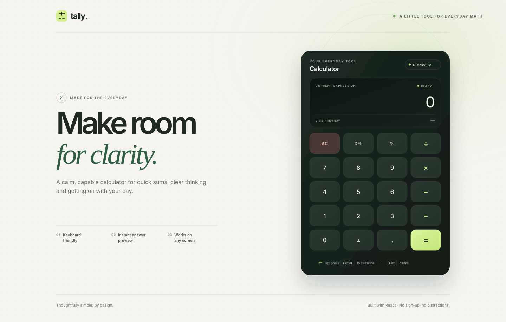

<h1 align="center">Tally — React Calculator</h1>

<p align="center">
  A calm, keyboard-friendly calculator for quick sums and clear thinking.
</p>

<p align="center">
  <a href="https://react.dev/"></a>
  <a href="https://vite.dev/"></a>
  
</p>

<p align="center">
  
</p>

---

## Overview

Tally is a small, focused calculator built with React. It combines a responsive interface with instant answer previews, keyboard controls, and a safe arithmetic parser—without adding unnecessary dependencies or distractions.

## Features

- **Everyday arithmetic** — addition, subtraction, multiplication, division, decimals, percentages, and negative values.
- **Instant answer preview** — see the result update as you enter a valid expression.
- **Keyboard support** — enter calculations without reaching for the mouse.
- **Responsive layout** — comfortable to use on desktop, tablet, and mobile screens.
- **Safe calculations** — evaluates supported math expressions without JavaScript `eval` or `Function`.
- **Accessible controls** — descriptive button labels, visible focus states, and an announced calculator display.

## Installation

### Requirements

- [Node.js](https://nodejs.org/) 20.19+ or 22.12+
- npm (included with Node.js)

### Set up the project

```bash
git clone https://github.com/Murli-B/React-calculator.git
cd React-calculator
npm ci
```

## Preview

Start the development server:

```bash
npm run dev
```

Open **http://localhost:5173** in your browser. Vite enables hot reload while you work.

To preview an optimized production build locally:

```bash
npm run build
npm run preview
```

## Keyboard shortcuts

| Key | Action |
| --- | --- |
| `0`–`9` | Enter a number |
| `+` `-` `*` `/` | Add, subtract, multiply, or divide |
| `%` | Convert the current value to a percentage |
| `.` | Enter a decimal point |
| `Enter` or `=` | Calculate |
| `Backspace` | Delete the last character |
| `Escape` | Clear the calculator |

## Available scripts

| Command | Description |
| --- | --- |
| `npm run dev` | Start the local development server |
| `npm run build` | Create a production build in `dist/` |
| `npm run preview` | Serve the production build locally |
| `npm run lint` | Run ESLint checks |

## Tech stack

- [React](https://react.dev/) for the interactive interface
- [Vite](https://vite.dev/) for development and production builds
- CSS for responsive styling and interaction states

## Project structure

```text
├── docs/
│   └── calculator-preview.svg # README interface preview
├── public/             # Static assets, including the app favicon
├── src/
│   ├── App.jsx          # Calculator UI, input handling, and arithmetic parser
│   ├── App.css          # Calculator and page styling
│   ├── index.css        # Global styles
│   └── main.jsx         # React application entry point
├── index.html           # Document metadata and root element
└── package.json         # Project scripts and dependencies
```
